<p align="right">
  <a href="README.md">English</a> · <a href="README.ko.md">한국어</a>
</p>

<p align="center">
  <picture>
    <source media="(prefers-color-scheme: dark)" srcset="assets/banner-dark.svg">
    <source media="(prefers-color-scheme: light)" srcset="assets/banner-light.svg">
    
  </picture>
</p>

<h1 align="center">git-claw</h1>
<p align="center">Agent Skills for consistent Git workflows</p>

<p align="center">
  
  <a href="https://agentskills.io"></a>
  
  
</p>

---

A consistent Git history that's easy to read — for both humans and agents.

git-claw is an [Agent Skill](https://agentskills.io) that keeps your commits, PRs, issues, and code reviews in a unified format. Install once, and every collaboration artifact follows the same conventions — whether you're working solo or in a team.

- **Readable history** — Structured commits, PRs, and issues that anyone (or any agent) can follow at a glance
- **Multi-model code review** — Domain agents + Codex adversarial analysis, cross-validated and severity-ranked
- **Session continuity** — `/handoff` captures work context so the next session picks up where you left off

---

### Skills

| | Skill | What it does |
|:---:|---|---|
| 📝 | `/commit` | Conventional commits from your diff |
| 🔀 | `/pr` | Structured PRs with auto-labeling |
| 📋 | `/issue` | Templated issues with priority labels |
| 💬 | `/review-reply` | Analyze and reply to review comments |
| 🔍 | `/code-review` | Multi-agent severity-based code review |
| 🤝 | `/handoff` | Session transfer prompt generation |

## Installation

### Claude Code Plugin (Recommended)

```bash
# Add marketplace
/plugin marketplace add chanmuzi/git-claw

# Install plugin
/plugin install git-claw@git-claw
```

### Skills CLI

```bash
npx skills add chanmuzi/git-claw
```

The interactive installer lets you select skills, target agents, scope (project/global), and install method.

<details>
<summary>Install all skills at once without prompts</summary>

```bash
npx skills add chanmuzi/git-claw --skill commit --skill pr --skill issue --skill review-reply --skill code-review --skill handoff -g
```

</details>

### Update

**Claude Code Plugin:**

```bash
/plugin update git-claw@git-claw
```

Or enable auto-update: `/plugin` → **Marketplaces** tab → select marketplace → **Enable auto-update**

**Skills CLI:**

```bash
npx skills check    # Check for updates
npx skills update   # Update all installed skills
```

> Symlink installs (recommended) apply updates to all agents at once. Copy installs require updating each copy individually.

## Skills

> **Skill prefix by agent:** Claude Code uses `/` (e.g., `/commit`), Codex CLI uses `$` (e.g., `$commit`).

### `/commit` — Create a Git Commit

Analyzes your staged/unstaged changes and proposes a commit message following the conventional commit format.

```
/commit              # Analyze and commit
/commit --amend      # Amend the last commit
```

Types: `feat` · `fix` · `refactor` · `style` · `docs` · `test` · `perf` · `chore` · `hotfix`

### `/pr` — Create a Pull Request

Creates a PR with a structured template. Automatically detects Individual or Release mode.

```
/pr              # Individual PR (Feat, Fix, Refactor, etc.)
/pr -g           # Include Mermaid change-flow graph
/pr release      # Release PR (dev → main integration)
```

### `/issue` — Create a GitHub Issue

Creates a structured issue with the appropriate template and auto-assigns type/priority labels.

```
/issue             # General issue (type inferred from context)
/issue bug         # Bug report
/issue feature     # Feature request
```

### `/review-reply` — Review & Reply to PR Comments

Collects review comments (CodeRabbit, Copilot, teammates, etc.) from a PR, analyzes their validity against the actual code, and discusses findings with you.

```
/review-reply          # Review current branch's PR
/review-reply 42       # Review PR #42
```

### `/code-review` — Context-Aware Code Review

Analyzes PR or local code changes using a multi-agent pipeline with domain-specific agents (Security, Performance, Architecture, Domain Logic). In PR mode, agents receive the PR's purpose as their primary review lens — catching incomplete implementations, consistency gaps, and purpose-misaligned changes. Cross-validates findings to filter false positives, with an out-of-diff causality filter that dismisses pre-existing issues unrelated to the PR. Produces severity-based output (🔴 Critical · 🟡 Warning · 🟢 Info). When no changes are detected, automatically transitions to reviewing the current working directory. Conversation context is used to determine the optimal review scope.

```
/code-review           # Auto-detect PR, review changes, or review cwd (context-aware)
/code-review 42        # Review PR #42
/code-review src/auth/ # Review specific path
```

In PR mode, findings are published as inline review comments on specific diff lines via the GitHub Review API.

<details>
<summary>Flags</summary>

- `--wd` — Force working directory mode, even on a PR branch
- `--domain security,perf` — Override auto-detected domains
- `-y` / `-f` — Publish without approval
- `-g` — Generate Mermaid change-flow graph (PR mode only)
- `-q` / `--quick` — Quick mode: single-pass, max 2 domains, Critical/Warning first
- `--full-scan` — Include pre-existing out-of-diff issues in General Findings (PR mode only)
- `--no-codex` — Disable Codex integration
- `--codex-both` — Run both Codex general review and adversarial review

</details>

<details>
<summary>Codex integration (optional)</summary>

When the [Codex plugin](https://github.com/openai/codex) is installed (`claude plugin add codex` + `!codex setup`), `/code-review` automatically runs Codex adversarial review in parallel with domain agents. Findings are cross-validated and merged with source tags. Use `--no-codex` to opt out.

</details>

### `/handoff` — Session Handoff Prompt

Generates a copy-ready handoff prompt that transfers work context to a new session. Auto-detects artifacts, git state, and conversation context, then structures a concise prompt following the **reference-not-repeat** principle.

```
/handoff                   # Auto-detect and generate handoff prompt
/handoff -y                # Skip confirmation, output directly
/handoff auth refactoring  # Focus on a specific topic
```

<details>
<summary>Details</summary>

**Detection cascade:** Artifacts (`.omc/specs/`, `.omc/plans/`) → Git state → Conversation context

**Skill recommendation:** When plugins like OMC or Codex are detected, the handoff recommends the most appropriate skill for the next session (e.g., `/autopilot`, `/ralph`, `/commit`).

**Output:** Terminal text optimized for `/copy`. Never repeats artifact content — references file paths instead.

</details>

## Language Behavior

All commands write output (commit messages, PR titles/body) in the language configured in your project's `CLAUDE.md`. If no language is set, the user's conversational language is used. Technical terms are kept in their original form.

## Conventions at a Glance

| Item | Format | Example |
|------|--------|---------|
| Commit | `{type}: {desc}` (lowercase) | `feat: 멀티턴 컨텍스트 유지 기능 추가` |
| Branch | `{type}/{kebab-case}` (English) | `feat/multiturn-context-persistence` |
| PR Title | `{Type}: {desc}` (capitalized) | `Feat: 멀티턴 컨텍스트 유지 기능 추가` |
| Release PR | `Release: dev → main 통합 (vX.Y.Z)` | `Release: dev → main 통합 (v0.4.1)` |

## Integration with CLAUDE.md

Add the following to your global `~/.claude/CLAUDE.md` to reference these conventions:

```markdown
## Git Conventions
- Commit: `{type}: {description}` (lowercase prefix: feat, fix, refactor, style, docs, test, perf, chore, hotfix)
- Branch: `{type}/{english-kebab-case}` (feat/, fix/, refactor/, docs/, hotfix/)
- PR title: `{Type}: {description}` (capitalized prefix: Feat, Fix, Refactor, Perf, etc.)
- Release PR: `Release: dev → main 통합 (vX.Y.Z)`
- Use `/commit`, `/pr`, `/pr release`, `/issue`, `/review-reply`, `/code-review`, `/handoff` commands for full workflows
```

## Label System

`/pr` and `/issue` share a unified label scheme. Labels are auto-created on first use — if a label already exists, it is left unchanged.

<details>
<summary>Label reference</summary>

| Label | Color | Source |
|-------|-------|--------|
| `bug` | 🔴 `d73a4a` | GitHub default |
| `feature` | 🔵 `0075ca` | GitHub default |
| `enhancement` | 🩵 `a2eeef` | GitHub default |
| `docs` | 🟣 `5319e7` | GitHub default |
| `chore` | 🟡 `e4e669` | Standard |
| `refactor` | 🟪 `d4c5f9` | Standard |
| `test` | 🟢 `bfd4f2` | Standard |
| `perf` | 🟠 `f9d0c4` | Standard |
| `hotfix` | 🔴 `b60205` | Standard |
| `release` | 🔵 `1d76db` | Standard |
| `critical` | 🔴 `b60205` | Priority |
| `high` | 🟠 `d93f0b` | Priority |
| `medium` | 🟡 `fbca04` | Priority |
| `low` | 🟢 `0e8a16` | Priority |

- **No namespace prefix** — clean, simple names (`bug` instead of `type: bug`)
- **GitHub-standard colors** — matches GitHub's default palette where applicable
- **Conflict-safe** — `gh label create ... 2>/dev/null || true` (create if missing, skip if exists)

</details>

## License

MIT
